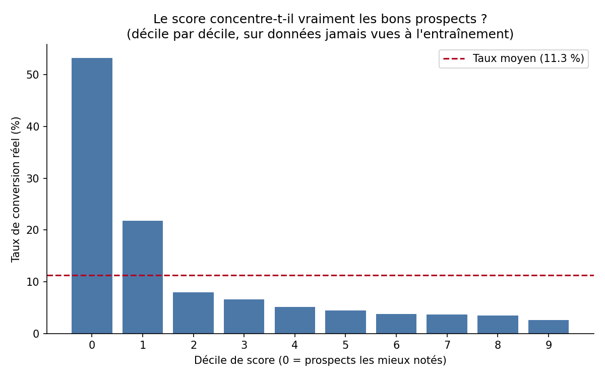
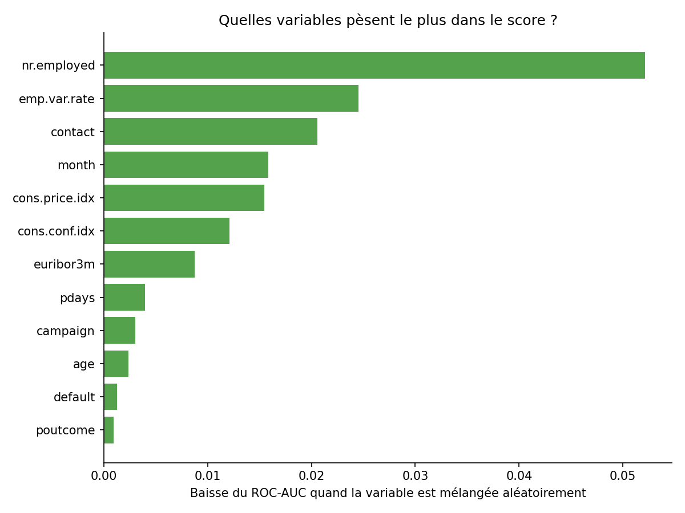
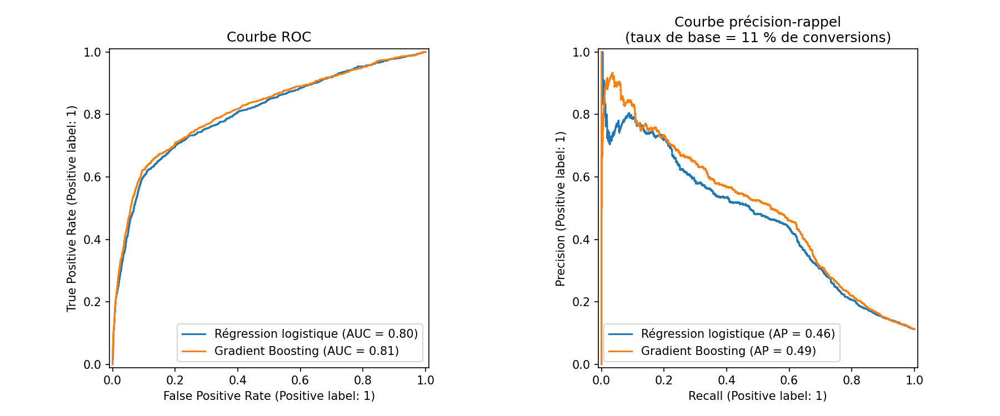

# Scoring de propension — qui contacter en premier ?

Le problème que je voulais traiter : une équipe commerciale n'a pas le temps de contacter tout son portefeuille avec la même intensité, donc autant savoir qui a le plus de chances de convertir avant d'appeler. Aucune vraie donnée de campagne B2B n'est publique, donc j'ai pris le dataset [UCI "Bank Marketing"](https://archive.ics.uci.edu/dataset/222/bank+marketing) (41 188 contacts télémarketing d'une banque, cible = souscription à un dépôt à terme) — la structure du problème (contact commercial → converti ou pas) est la même qu'un scoring de leads, seul le secteur change.

## Reproduire

```bash
pip install -r requirements.txt
python3 scripts/train_scoring_model.py
```

## Le résultat qui compte pour un commercial



Un ROC-AUC ne veut rien dire pour quelqu'un qui doit décider qui appeler demain matin. Ce qui compte : **les 10 % de prospects les mieux notés convertissent à 53 %, contre 11 % en moyenne sur tout le portefeuille — un gain ×4,7.** À volume de contacts identique, prioriser ce décile plutôt que d'appeler au hasard change complètement le rendement de la journée.

## Deux détails techniques sur lesquels je ne voulais pas me planter

**La fuite de données.** Ce dataset a un piège connu : la colonne `duration` (durée de l'appel) fait exploser l'AUC (~0,90) si on la garde — sauf qu'elle n'existe qu'une fois l'appel terminé. L'utiliser pour décider "qui appeler" reviendrait à se servir du futur pour prédire le présent. Je l'ai retirée dès le départ, quitte à perdre en performance affichée.

**L'importance des variables, bien calculée.** Le réflexe le plus courant est de lire `feature_importances_` directement sur les colonnes one-hot encodées — et de se retrouver avec `job_admin.`, `job_blue-collar`, `job_entrepreneur`... chacune avec un score minuscule, illisible. J'ai calculé l'importance par permutation sur les colonnes d'origine (`job`, pas ses 12 modalités séparées), ce qui donne un vrai classement business exploitable.



Et ce classement m'a surpris : ce qui pèse le plus, ce sont des variables macroéconomiques et temporelles (`nr.employed`, `emp.var.rate`, le mois de contact) — pas le profil du client. Concrètement, le modèle a surtout appris **à quel moment la campagne marche**, pas **quel client convertit**. Je m'attendais à ce que l'âge ou l'historique du client ressortent davantage. Ce n'est pas un problème à cacher — c'est un vrai résultat, et il change la conclusion : sur un cas B2B réel, il faudrait enrichir les données avec du comportemental (secteur, taille d'entreprise, historique d'achat) avant de faire confiance au score pour trier des individus plutôt qu'une période.

## Comparatif des modèles

| Modèle | ROC-AUC | PR-AUC |
|---|---|---|
| Régression logistique | 0,805 | 0,463 |
| **Gradient Boosting** | **0,814** | **0,493** |



PR-AUC compte plus que l'accuracy ici : avec 11 % de conversions seulement, un modèle qui prédirait toujours "non" aurait déjà 89 % d'accuracy sans rien apprendre. Le Gradient Boosting gagne sur les deux métriques, d'assez peu — ce qui confirme que la régression logistique n'était pas un mauvais choix de départ.

## Ce que ces chiffres ne couvrent pas

Le dataset est du retail bancaire, pas du B2B/PME réel — la méthode se transpose, le facteur ×4,7 non. Rien n'est dit non plus sur le coût réel d'un contact commercial vs la valeur d'une conversion, qui déterminerait le vrai décile de coupure à utiliser (peut-être que descendre jusqu'au 3ᵉ ou 4ᵉ décile reste rentable, peut-être pas). Et vu le poids des variables macroéconomiques, un modèle figé se dégraderait probablement assez vite si le contexte économique change — un vrai déploiement demanderait un suivi et un ré-entraînement régulier (voir [automatisation-reporting-insee](https://github.com/ATEYABA-K/automatisation-reporting-insee) pour l'idée du pipeline qui fait ça tout seul).

Si je reprenais ce projet : calibrer les probabilités (`CalibratedClassifierCV`) pour qu'elles soient lisibles comme de vraies probabilités et pas juste un rang, et traiter le mois comme une variable cyclique plutôt que catégorielle — décembre et janvier sont proches dans le temps, pas dans un encodage one-hot.

Alvin Kouadio
